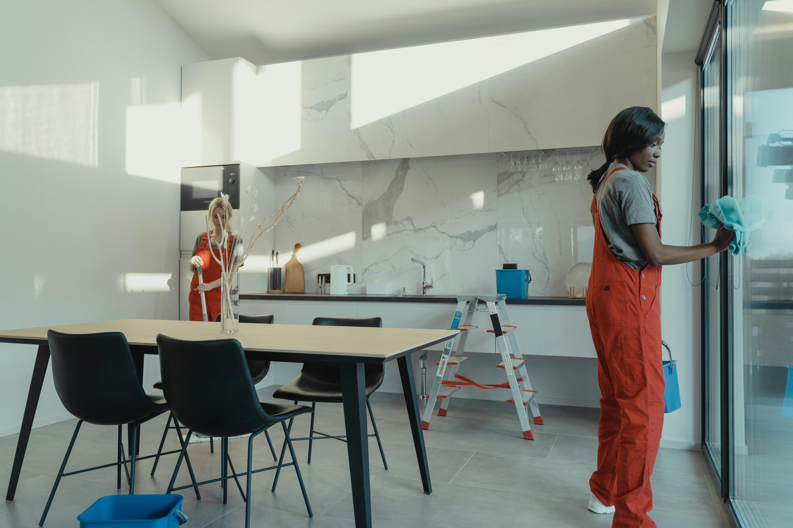

# TidyHome Services

## The Tidy Home Cleaners website serves as a landing page for individuals and offices in Dublin City and its surrounding areas, offering professional cleaning services.

## Features

- **Navigation Bar**: 
  - The top of the page features a navigation bar with the home cleaning name, Tidy Home Cleaning, on the left, which links to the top of the page.
  - The right side of the navigation bar includes links to different sections of the page: About Us, Services, and Contact Us.
  - The navigation link has a hover border line of light gray color ('#ccc') for user indication.
  - The header has a white background and the text color is a shade of dark gray for better contrast.
  - The image explains that the site is for cleaning services.
  - This section provides the user with clear information about what the site is about.
  
  

  

  
- **About Us Page**: 
  - This page explains why we are the best home cleaners.

- **Contact Us Page**:
  - Includes a form where users can provide their full name, email, and details about the service they want.

- **Services We Offer**:          
  - One-Off Deep Cleaning
  - End of Tenancy Cleaning          
  - Upholstery Cleaning
  - Carpet Cleaning
  - After Builders Cleaning
  - Bathroom Steam Cleaning
  - Regular House Cleaning Services
  - Power Washing Driveways

## Contact Information

For more information or to schedule a service, please contact us:

- **Phone:** +353-899-720-953
- **Email:** omonuwaosai@gmail.com
- **Address:** Tidy Home, 3 Meeting House Lane, Dublin, Ireland

## Usage

Visit our website to learn more about our services, schedule a cleaning, or get in touch with our team.

## Technologies Used

- HTML
- CSS

## Testing

- **Browser Compatibility**: Tested on Chrome, Microsoft Edge, Firefox, and Safari.
- **Responsiveness**: Confirmed the site looks good and functions on all standard screen sizes using devtools device toolbar.
- **Readability**: Ensured that the navigation, header, About Us, Services, and Contact text are all readable and easy to understand.
- **Form Functionality**: Verified that the form requires entries in every field, accepts only a valid email in the email field, and the submit button works.

## Solved Bugs

- **Contact Us Form**: Fixed an issue where the footer was floating after submitting the form. Resolved by setting the/* Reset default styles (wildcard) */
* {
    margin: 0;
    padding: 0;
    box-sizing: border-box; /* Add box-sizing reset */
}  .

## Validation Testing

- **HTML**: No errors were returned when passing through the official W3C validator.
- **CSS**: No errors were found when passing through the official (Jigsaw) validator.

## Getting Started

To run this project locally:

1. Clone the repository: `git clone https://github.com/desmond0147/tidyhome-services.git`
2. Navigate to the project directory: `cd tidyhome-services`
3. Open `index.html` in your web browser to view the site.

[Live Demo](https://desmond0147.github.io/tidyhome-services/index.html)

## Credits

- **Inspiration**: Love Running walkthrough project, Ai, google, YouTube Learn Web.
- **Media**: Images were taken from Pexels. 

## Contributing

We welcome contributions to improve our services and website. Please fork the repository and create a pull request with your changes.

## License

This project is licensed under the MIT License.