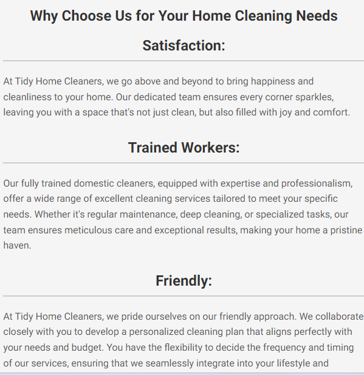
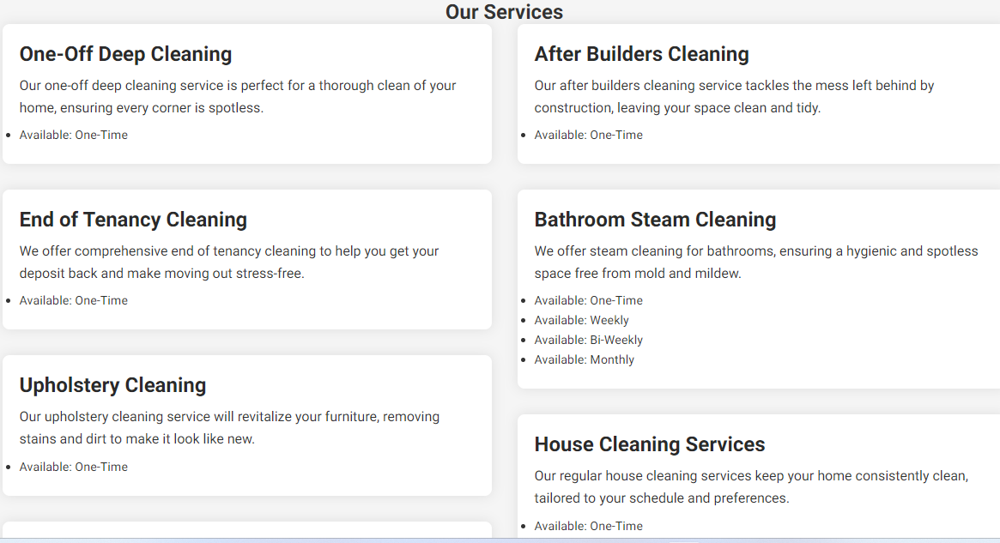
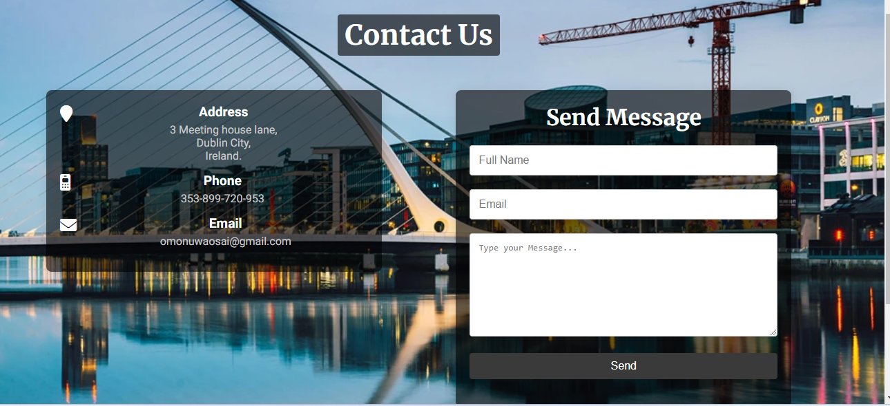
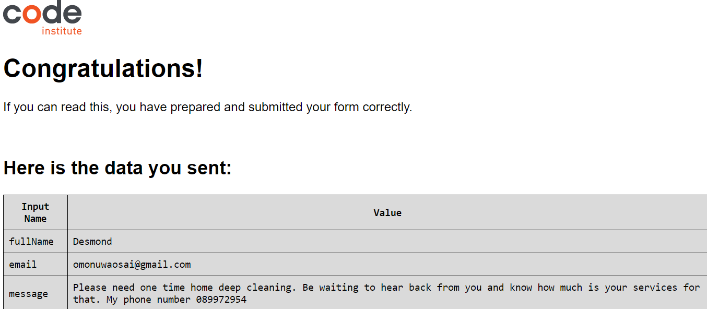
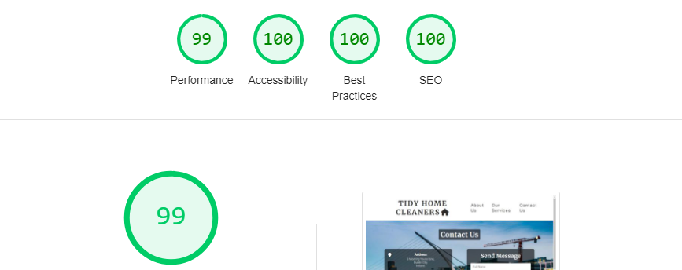

# TidyHome Services

## The Tidy Home Cleaners website serves as a landing page for individuals and offices in Dublin City and its surrounding areas, offering professional cleaning services.

## Features

- **Navigation Bar**: 
  - The top of the page features a navigation bar with the home cleaning name, Tidy Home Cleaning, on the left, which links to the top of the page.
  - The right side of the navigation bar includes links to different sections of the page: About Us, Services, and Contact Us.
  - The navigation link has a hover border line of light gray color ('#ccc') for user indication.
  - The header has a white background and the text color is a shade of dark gray for better contrast.
  - The image explains that the site is for cleaning services.
  - This section provides the user with clear information about what the site is about.
  
  

 

### About Us Page

#### Why Choose Us for Your Home Cleaning Needs

- The About Us section gives details about what Tidy Home Cleaners offer their members and includes headers and paragraphs outlining their services:
  - Satisfaction
  - Trained workers
  - Friendly
  - Stress-free

  

 ### Services Section

- **Services section show the types of services they offer and includes headers and paragraphs explaining their services, outlining their services:**
  - **Satisfaction Guaranteed**
    - One-Off Deep Cleaning
    - End of Tenancy Cleaning
    - Upholstery Cleaning
    - Carpet Cleaning
    - After Builders Cleaning
    - Bathroom Steam Cleaning
    - Regular House Cleaning Services
    - Power Washing Driveways

    

## Contact Information

- This section contains a form where the user can send a message. The form includes fields for the user's full name, email, and a text box where the user can describe the services they want.
- When the form is submitted, it will open in a new tab. The form's reply response is directed to Code Institute; this is just for project purposes as the company does not actually exist.
- The background image is a city center image showing offices, which are the company's target for cleaning services, and the water symbolizes cleanliness.

## Technologies Used

- HTML
- CSS

## Testing

- **Browser Compatibility**: Tested on Chrome, Microsoft Edge, Firefox, and Safari.
- **Responsiveness**: Confirmed the site looks good and functions on all standard screen sizes using devtools device toolbar.
- **Readability**: Ensured that the navigation, header, About Us, Services, and Contact text are all readable and easy to understand.
- **Form Functionality**: Verified that the form requires entries in every field, accepts only a valid email in the email field, and the submit button works.

## Validation Testing

- **HTML**: No errors were returned when passing through the official W3C validator.
- **CSS**: No errors were found when passing through the official Jigsaw validator.

## Validation Testing

- **HTML**: No errors were returned when passing through the official W3C validator.
- **CSS**: No errors were found when passing through the official Jigsaw validator.

## Accessibility

- I confirmed that the colors and fonts chosen are easy to read.
- The image performance is also good, as confirmed by running it through Lighthouse in DevTools.

# Getting Started

This section provides instructions on how to set up and run the project locally, as well as an overview of the deployment process.

## Setting Up Locally

To run this project locally:

- **Clone the repository**: Start by cloning the repository to your local machine using the following command:git clone https://github.com/desmond0147/tidyhome-services.git

- **Navigate to the project directory**: Change into the project directory: cd tidyhome-services

- **Open the project**: Open `index.html` in your web browser to view the site: open index.html

## Deployment Process

The project is deployed to GitHub Pages, which is a static site hosting service that takes files from a GitHub repository and serves them as a website.

Here are the steps followed to deploy the project:

- **Create a repository on GitHub**: A new repository named `tidyhome-services` was created on GitHub.

- **Link the repository to Gitpod**: The GitHub repository was linked to a Gitpod workspace for an integrated development environment that supports running the project directly in the browser.

- **Develop the project**: The project was developed within the Gitpod environment, making use of its features for writing, testing, and debugging the code.

- **Commit and push changes**: Changes were committed and pushed to the GitHub repository regularly using the following commands:
git add .
git commit -m "Commit message describing the changes"
git push

## Deploy to GitHub Pages

The project was deployed to GitHub Pages by enabling GitHub Pages in the repository settings. The main branch was selected as the source for GitHub Pages, and the site is available at the following URL: [tidyhome-services GitHub Pages](https://desmond0147.github.io/tidyhome-services/).

## Credits

- **Inspiration**: Love Running walkthrough project, Ai, google, YouTube Learn Web, mentor call sections.
- **Media**: Images were taken from Pexels. https://redketchup.io/image-resizer was use to resize image

## Contributing

We welcome contributions to improve our services and website. Please fork the repository and create a pull request with your changes.

## License

This project is licensed under the MIT License.

- Fixed an issue where the footer was floating after submitting the form. Resolved by setting the default styles to:

css
* {
    margin: 0;
    padding: 0;
    box-sizing: border-box; 
}